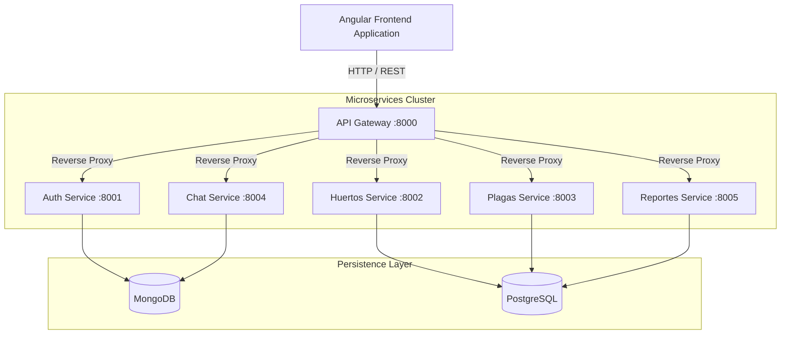

# HuertoConnect

HuertoConnect is a comprehensive monorepo project containing the microservices-based backend API and the Angular frontend application. It provides advanced cultivation, planning, and pest management tools using a modern, scalable architecture.

## Architecture Overview

The backend is built upon a microservices architecture coordinated by an API Gateway. It utilizes both relational (PostgreSQL) and document-based (MongoDB) databases depending on the service requirements.



## Repository Structure

The monorepo is divided into two main environments:

- **`HuertoConnect_API/`**: Contains the Docker Compose configuration and the Python FastAPI microservices.
- **`LP_HC_V2/huerto-Connect-develop/`**: Contains the Angular 17+ Client Application.

## Technology Stack

### Frontend
- **Framework:** Angular
- **Language:** TypeScript
- **Styling:** SCSS
- **State Management & Async:** RxJS

### Backend
- **Core:** Python 3.12
- **Framework:** FastAPI, Uvicorn
- **Integration:** HTTPX (Gateway Proxy)
- **Authentication:** Google OAuth2 Identity Services, JWT Session Management

### Infrastructure & Persistence
- **Containers:** Docker, Docker Compose
- **Databases:** PostgreSQL, MongoDB
- **Deployment:** Railway (Production Readiness Check Complete), Netlify (Frontend)

## Getting Started

### Prerequisites

Ensure the following tools are installed on your host machine:
- [Docker Engine & Docker Compose](https://docs.docker.com/engine/install/)
- [Node.js](https://nodejs.org/) (Version 18 or higher)
- [Angular CLI](https://angular.io/cli)

### Backend Execution

The backend ecosystem is fully containerized. To spin up the gateway, the microservices, and the databases:

```bash
cd HuertoConnect_API
docker-compose up --build -d
```

Once running, the central API Gateway will be exposed on port `8000`.
- Unified Swagger UI Documentation: `http://localhost:8000/docs`
- Health Check Endpoint: `http://localhost:8000/api/health`

### Frontend Execution

To run the Angular application locally connecting to the backend gateway:

```bash
cd LP_HC_V2/huerto-Connect-develop
npm install
npx ng serve --host 127.0.0.1 --port 4300
```
Access the application at `http://127.0.0.1:4300`.

## Environment Configuration

Production environments rely on injected environment variables. For local development, refer to `.env.example` configurations. Key required variables include:

- `JWT_SECRET`
- `MONGO_URI`
- `POSTGRES_DB`, `POSTGRES_USER`, `POSTGRES_PASSWORD`
- `GOOGLE_CLIENT_ID`

Service routing variables (`AUTH_SERVICE_URL`, etc.) are resolved automatically via Docker's internal DNS or Railway's Private Networking during deployment.

## License

All rights reserved. HuertoConnect.
